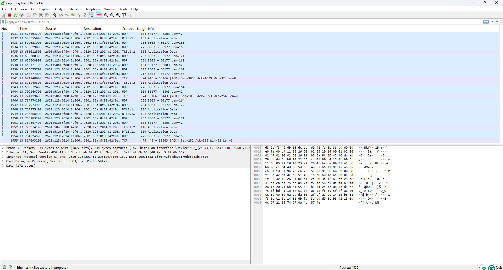

# Darwin-Wireshark-Network-Traffic-Analysis-Lab
 A hands-on Wireshark lab demonstrating packet capture, network traffic analysis, DNS resolution, TLS/HTTPS inspection, TCP three-way handshake analysis, ICMPv6 traffic, protocol hierarchy, endpoint statistics, display filters, and packet-level troubleshooting.

---

## Repository Description

A hands-on Wireshark lab demonstrating packet capture, network traffic analysis, DNS resolution, TLS/HTTPS inspection, TCP three-way handshake analysis, ICMPv6 traffic, protocol hierarchy, endpoint statistics, display filters, and packet-level troubleshooting.

---

# Wireshark Network Traffic Analysis Lab

## Overview

This project demonstrates how to capture and analyze live network traffic using Wireshark. The lab covers essential networking concepts including DNS resolution, encrypted TLS/HTTPS communication, TCP connection establishment, ICMPv6 traffic, protocol hierarchy, endpoint analysis, packet inspection, and network troubleshooting.

This project showcases practical skills commonly used by Help Desk Technicians, Network Support Technicians, and SOC Tier 1 Analysts.

---

# Objectives

- Capture live network traffic
- Analyze DNS requests and responses
- Inspect encrypted TLS/HTTPS traffic
- Examine ICMPv6 network communication
- Understand the TCP three-way handshake
- Analyze packet headers
- Review protocol hierarchy
- Examine network conversations
- Identify communication endpoints
- Review capture statistics
- Use Wireshark display filters
- Inspect raw packet bytes

---

# Technologies Used

- Wireshark 4.6.6
- Npcap
- Windows 11
- TCP/IP
- IPv4
- IPv6
- DNS
- TLS/HTTPS
- Ethernet

---

# Skills Demonstrated

- Network Traffic Analysis
- Packet Capture
- DNS Analysis
- HTTPS/TLS Traffic Analysis
- TCP/IP Troubleshooting
- IPv4 & IPv6 Analysis
- Packet Inspection
- Protocol Analysis
- Network Diagnostics
- Display Filters
- Security Monitoring

---

# Screenshots

### 01. Live Packet Capture

Captured live network traffic from the active Ethernet interface showing real-time network communications.

---

### 02. DNS Traffic

Filtered DNS traffic displaying domain name queries and responses.

---

### 03. TLS Traffic

Filtered encrypted TLS 1.2 traffic demonstrating secure HTTPS communications.

---

### 04. ICMP Ping

Filtered ICMPv6 traffic displaying Neighbor Discovery, Router Advertisement, and Multicast Listener messages.

> **Note:** Rename your screenshot to **04-icmp-ping.png**.

---

### 05. TCP Three-Way Handshake

Filtered TCP SYN packets demonstrating the TCP connection establishment process.

---

### 06. Packet Details

Expanded packet information displaying Ethernet, IP, TCP, and protocol header details.

---

### 07. Protocol Hierarchy

Protocol Hierarchy Statistics showing protocol distribution throughout the packet capture.

---

### 08. Conversations

Conversation statistics showing communication sessions between hosts.

---

### 09. Endpoints

Endpoint statistics displaying network devices involved in the capture.

---

### 10. Capture File Properties

Capture properties displaying capture duration, interface information, packet statistics, and metadata.

---

### 11. Display Filters

Demonstrated Wireshark display filters used to isolate and analyze specific network protocols.

---

### 12. Packet Bytes

Hexadecimal and ASCII packet data used for low-level packet inspection and forensic analysis.

