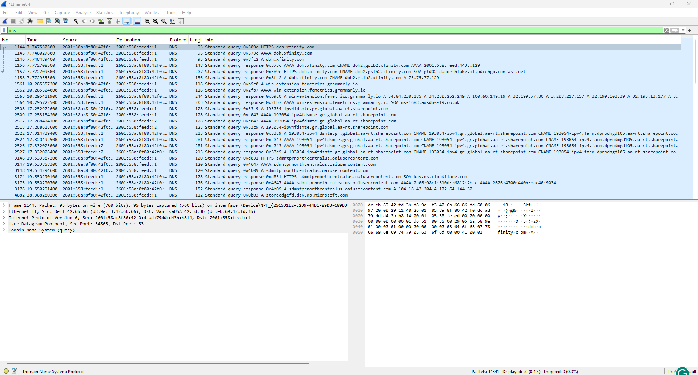
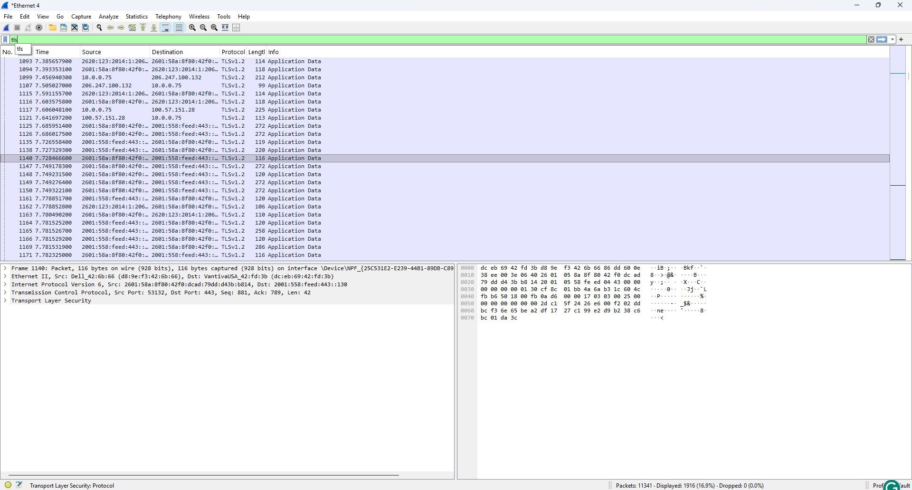
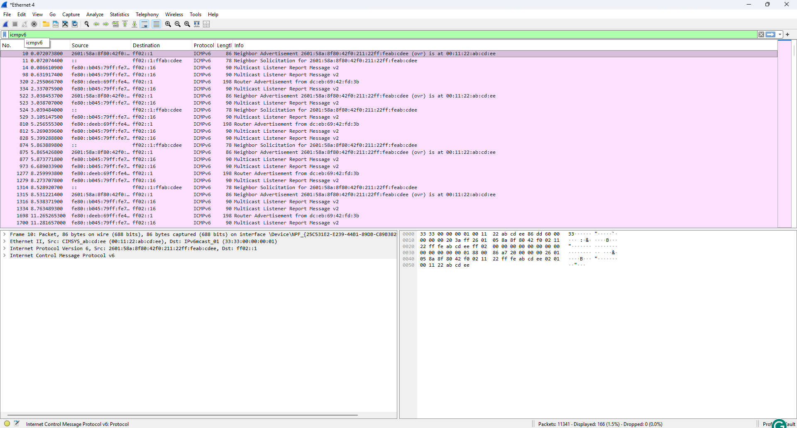
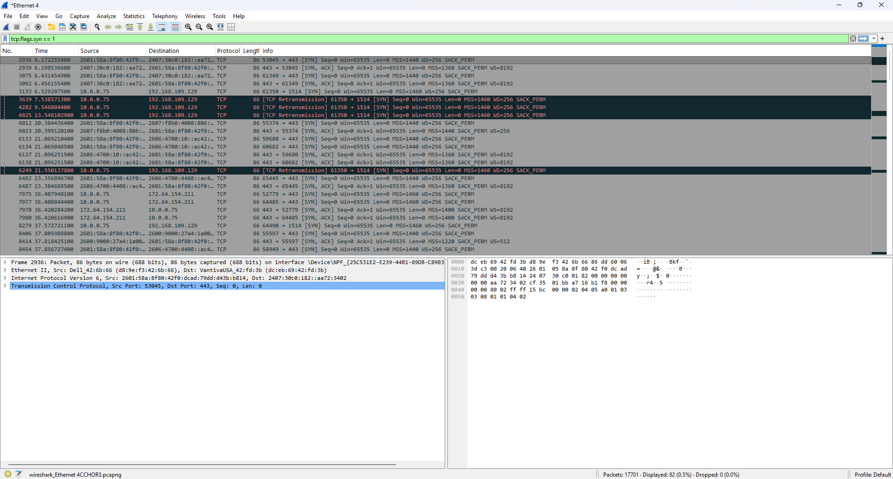
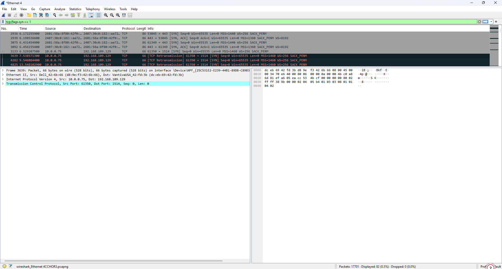
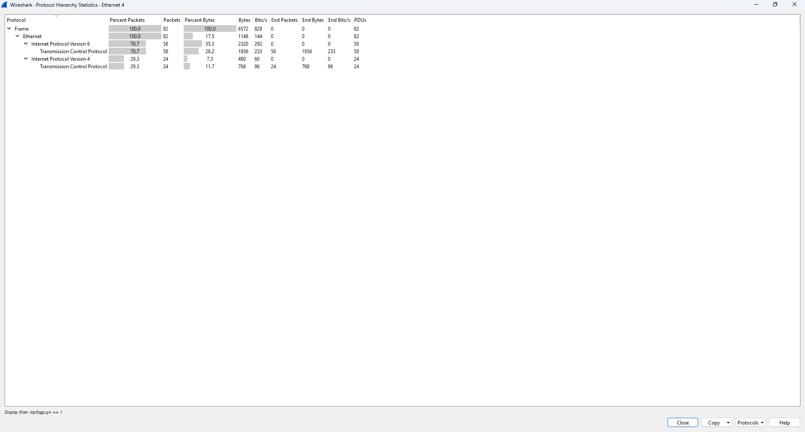
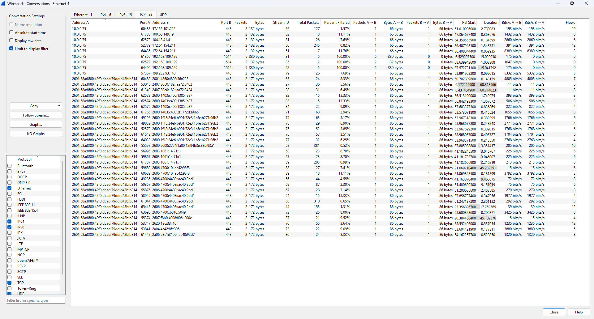
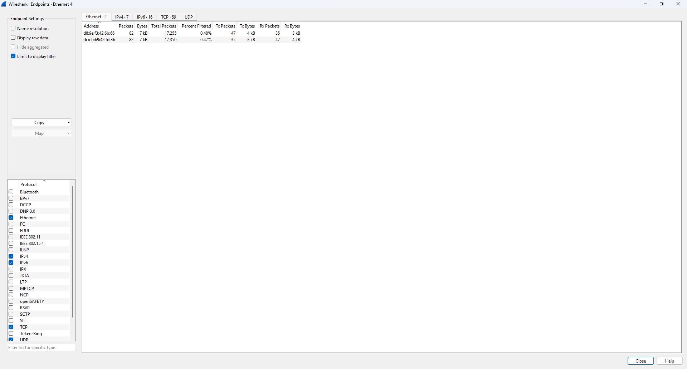
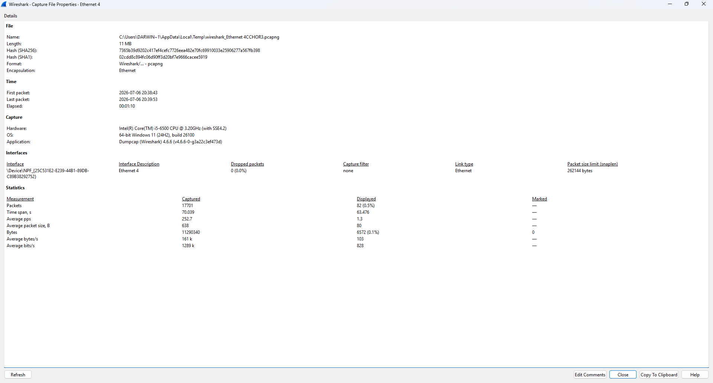

# Darwin-Wireshark-Network-Traffic-Analysis-Lab
 A hands-on Wireshark lab demonstrating packet capture, network traffic analysis, DNS resolution, TLS/HTTPS inspection, TCP three-way handshake analysis, ICMPv6 traffic, protocol hierarchy, endpoint statistics, display filters, and packet-level troubleshooting.

---

## Repository Description

A hands-on Wireshark lab demonstrating packet capture, network traffic analysis, DNS resolution, TLS/HTTPS inspection, TCP three-way handshake analysis, ICMPv6 traffic, protocol hierarchy, endpoint statistics, display filters, and packet-level troubleshooting.

---

# Wireshark Network Traffic Analysis Lab

## Overview

This project demonstrates how to capture and analyze live network traffic using Wireshark. The lab covers essential networking concepts including DNS resolution, encrypted TLS/HTTPS communication, TCP connection establishment, ICMPv6 traffic, protocol hierarchy, endpoint analysis, packet inspection, and network troubleshooting.

This project showcases practical skills commonly used by Help Desk Technicians, Network Support Technicians, and SOC Tier 1 Analysts.

---

# Objectives

- Capture live network traffic
- Analyze DNS requests and responses
- Inspect encrypted TLS/HTTPS traffic
- Examine ICMPv6 network communication
- Understand the TCP three-way handshake
- Analyze packet headers
- Review protocol hierarchy
- Examine network conversations
- Identify communication endpoints
- Review capture statistics
- Use Wireshark display filters
- Inspect raw packet bytes

---

# Technologies Used

- Wireshark 4.6.6
- Npcap
- Windows 11
- TCP/IP
- IPv4
- IPv6
- DNS
- TLS/HTTPS
- Ethernet

---

# Skills Demonstrated

- Network Traffic Analysis
- Packet Capture
- DNS Analysis
- HTTPS/TLS Traffic Analysis
- TCP/IP Troubleshooting
- IPv4 & IPv6 Analysis
- Packet Inspection
- Protocol Analysis
- Network Diagnostics
- Display Filters
- Security Monitoring

---

# Screenshots

### 01. Live Packet Capture

Captured live network traffic from the active Ethernet interface showing real-time network communications.

---

### 02. DNS Traffic

Captured DNS queries and responses showing domain name resolution.

---

### 03. TLS Traffic

Captured encrypted TLS traffic demonstrating secure HTTPS communication.

---

### 04. ICMPv6 Network Traffic

Captured ICMPv6 Neighbor Discovery and Router Advertisement traffic.

---

### 05. TCP Three-Way Handshake

Captured TCP SYN packets demonstrating the TCP three-way handshake used to establish a connection.

---

### 06. Packet Details

Expanded packet details displaying Ethernet, IP, TCP, and protocol header information.

---

### 07. Protocol Hierarchy

Protocol Hierarchy Statistics showing the distribution of protocols in the packet capture.

---

### 08. Conversations

Conversation statistics displaying communication sessions between local and remote hosts.

---

### 09. Endpoints

Endpoint statistics showing network devices involved in the packet capture.

---

### 10. Capture File Properties

Capture file information including interface details, packet statistics, duration, and metadata.

---

### 11. Display Filters

Demonstrated Wireshark display filters used to isolate specific protocols and packet types.

---

### 12. Packet Bytes

Displayed the hexadecimal and ASCII representation of a captured packet for detailed packet inspection.

